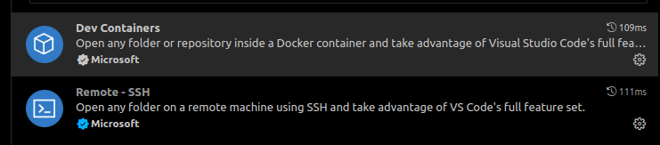
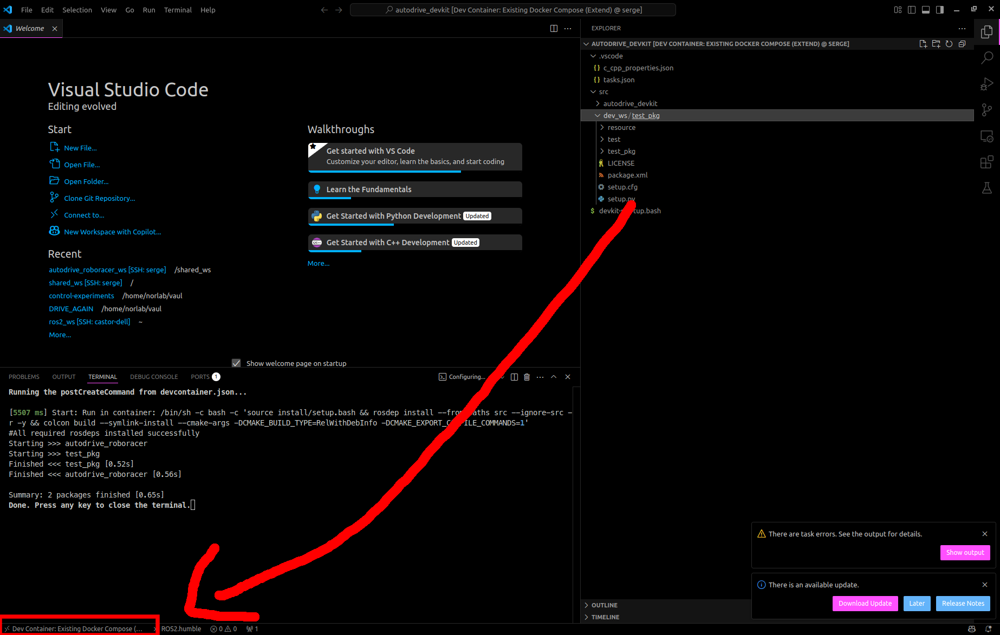

# mtt_project

## Installation

Tested on:
- Ubuntu 24
- Ubuntu 22

### Prerequistes

- Vscode
- Docker

### Steps

1. Clone the repo

```bash
git clone git@github.com:AlexCampanozzi/mtt_project.git
```

2. Enable xhost to properly forward GUI
```bash
xhost +local:docker
```

3. Open in vscode

```bash
cd mtt_project
code .
```

4. Make sure you have the "Dev Containers" and "Remote - SSH" extension installed in vscode



5. Build the container with Ctrl+Shift+P and select "Dev Containers: Rebuild and Reopen in Container". Vscode should build the container and open your vscode frontend inside of it

6. Now you should be inside the container, on the bottom left of the screen, make sure you see this



7. You can now try to launch the simulation in a vscode terminal
```bash
ros2 launch mtt_bringup mtt_simulation.launch.py
```

8. If you want to rebuild the workspace, do Ctrl+Shift+B and select "colcon: Colcon Build with compile_commands"
