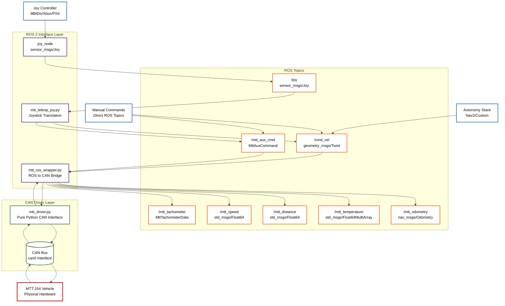

## Current MTT-154 Driver Architecture
*Updated for CAN Bus Specification v1.1 Compliance with Telemetry*

### Component Overview

**Input Sources:**
- **Joy Controller**: Physical joystick (8BitDo, Xbox, PS4) for manual teleoperation
- **Autonomy Stack**: Navigation systems (Nav2, custom) for autonomous operation
- **Manual Commands**: Direct ROS topic publishing for testing and development

**ROS 2 Interface Layer:**
- **joy_node**: Standard ROS joystick driver publishing sensor_msgs/Joy
- **mtt_teleop_joy.py**: Translates joystick input to vehicle commands (/cmd_vel, /mtt_aux_cmd)
- **mtt_ros_wrapper.py**: Bridges standard ROS topics to the CAN interface for control and publishes telemetry data from the vehicle

**ROS Topics:**
*Control Topics:*
- **/joy**: Raw joystick input (sensor_msgs/Joy)
- **/cmd_vel**: Standard velocity commands (geometry_msgs/Twist)
- **/mtt_aux_cmd**: Auxiliary commands like brake, winch, and dead-man switch (MttAuxCommand)

*Telemetry Topics:*
- **/mtt_speed**: Vehicle speed in km/h (std_msgs/Float64)
- **/mtt_distance**: Cumulative distance traveled in km (std_msgs/Float64)
- **/mtt_temperature**: Motor controller temperatures (std_msgs/Float64MultiArray)
- **/mtt_tachometer**: Raw, detailed telemetry from the CAN bus (MttTachometerData)
- **/mtt_odometry**: Standard odometry message for navigation stacks (nav_msgs/Odometry)

**CAN Driver Layer:**
- **mtt_driver.py**: Pure Python CAN interface with a threaded listener for receiving telemetry. No ROS dependencies
- **CAN Bus**: SocketCAN interface (e.g., can0) for physical vehicle communication

**Vehicle Hardware:**
- **MTT-154**: Physical vehicle with a CAN bus control and telemetry interface

### Key Features

1. **Standard ROS Integration**: Uses standard topics (/cmd_vel, /mtt_odometry) for easy integration
2. **Telemetry Publishing**: Provides real-time vehicle data (speed, distance, temperature) on ROS topics
3. **Odometry for Navigation**: Publishes standard nav_msgs/Odometry for use with Nav2 and SLAM
4. **Flexible Input**: Supports joysticks, autonomy stacks, and direct manual commands
5. **Safety First**: Implements a dead-man switch, E-stop functionality, and safe startup defaults
6. **Modular Design**: The ROS wrapper and pure Python CAN driver can be used independently
7. **CAN Bus v1.1 Compliance**: Adheres to the latest CAN bus specification for reliable control
8. **Speed/Distance Tracking**: Accurate odometry from tachometer data

### Safety Systems

- Dead man's switch requirement for motion
- Emergency stop functionality
- Safe default values on startup
- Proper shutdown procedures
- **Security switch management (CANBus_Specification.md v1.1)**: Bit 7 (0x80) for vehicle unlock
- **Temporary emergency stop patch**: Light control acts as E-stop mechanism
- **System readiness checks**: Both security switch and light state validation

### Data Flow

**Teleoperation**: Joy → joy_node → mtt_teleop_joy → Topics → mtt_ros_wrapper → mtt_driver → CAN → Vehicle
**Autonomy**: Nav2 Stack → /cmd_vel Topic → mtt_ros_wrapper → mtt_driver → CAN → Vehicle  
**Telemetry**: Vehicle → CAN → mtt_driver → mtt_ros_wrapper → Telemetry & Odometry Topics

### Current Specification Updates

**CAN Bus Compliance:**
- Security switch corrected to bit 7 (0x80) instead of bit 3 (0x08)
- Emergency stop patch: Light control temporarily acts as E-stop
- Tachometer data parsing from CAN 0x2FF (MSB-first byte order)
- Speed calculation using manufacturer-provided gear ratios

**New ROS Topics:**
- `/mtt_tachometer`: Complete tachometer data structure
- `/mtt_speed`: Real-time speed in km/h
- `/mtt_distance`: Cumulative distance traveled
- `/mtt_temperature`: Temperature sensor readings
- `/mtt_odometry`: Standard odometry message for navigation stacks (nav_msgs/Odometry)

**Enhanced Safety:**
- Dual safety mechanism: Security switch + light state validation
- Improved system readiness checks before motion commands
- Better error handling and fault detection

**Message Types:**
- Added `MttTachometerData.msg` for comprehensive telemetry
- Maintains compatibility with standard ROS message types  
